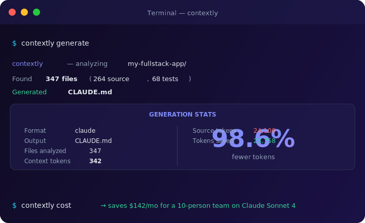
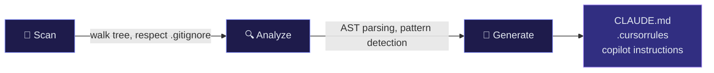

<div align="center">


<br/>

> **Every AI coding session starts by re-reading your entire codebase.**
> contextly fixes that — one command, 98% fewer tokens, same quality.

<br/>

[](https://pypi.org/project/contextly/)
[](https://github.com/sanyamk23/contextly/actions)
[](https://opensource.org/licenses/MIT)
[](https://pypi.org/project/contextly/)

[Get Started](#-get-started-in-30-seconds) · [How It Works](#-how-it-works) · [Cost Calculator](#-see-exactly-how-much-you-save) · [CI Integration](#-keep-it-fresh-with-ci)

</div>

---

## The $800/month Problem

<br/>

<table>
<tr>
<td width="50%" valign="top">

### Without contextly

```
$ claude
> Fix the auth bug

⏳ Reading 47 files...
   Analyzing codebase...
   8,400 tokens burned
   $0.025 spent

   ...ok, what's the bug?
```

**Every session. Every question.**
AI re-reads your entire project.
5,000–25,000 tokens of pure waste.

1 dev, 20 sessions/day = **$30/mo**
10 devs, 20 sessions/day = **$800/mo**

</td>
<td width="50%" valign="top">

### With contextly

```
$ contextly generate
  ✓ CLAUDE.md (342 tokens)

$ claude
> Fix the auth bug

   342 tokens loaded
   $0.001 spent

   ...I see the bug, it's in auth.py:42
```

**One command. Every session.**
AI reads a 342-token cheat sheet.
98.6% fewer context tokens.

1 dev, 20 sessions/day = **$0.50/mo**
10 devs, 20 sessions/day = **$5/mo**

</td>
</tr>
</table>

---

## See Exactly How Much You Save

<br/>

<div align="center">



</div>

<br/>

<table>
<tr>
<th>Provider</th>
<th>Without Contextly</th>
<th>With Contextly</th>
<th>Saved</th>
<th>Monthly (1 dev, 20 sessions)</th>
</tr>
<tr>
<td><strong>Claude Opus 4</strong></td>
<td>$0.3615</td>
<td>$0.0051</td>
<td style="color:#22c55e;font-weight:bold">99%</td>
<td style="color:#22c55e;font-weight:bold">$7.13</td>
</tr>
<tr>
<td><strong>Claude Sonnet 4</strong></td>
<td>$0.0723</td>
<td>$0.0010</td>
<td style="color:#22c55e;font-weight:bold">99%</td>
<td style="color:#22c55e;font-weight:bold">$1.43</td>
</tr>
<tr>
<td><strong>GPT-4o</strong></td>
<td>$0.0603</td>
<td>$0.0009</td>
<td style="color:#22c55e;font-weight:bold">99%</td>
<td style="color:#22c55e;font-weight:bold">$1.19</td>
</tr>
<tr>
<td><strong>Gemini 2.5 Pro</strong></td>
<td>$0.0301</td>
<td>$0.0004</td>
<td style="color:#22c55e;font-weight:bold">99%</td>
<td style="color:#22c55e;font-weight:bold">$0.60</td>
</tr>
</table>

<br/>

### Team Scale

| Team Size | Sessions/Day | Monthly Cost (Before) | Monthly Cost (After) | **You Save** |
|---|---|---|---|---|
| 1 dev | 20 | $14.46 | $0.20 | **$14.26/mo** |
| 5 devs | 20 | $72.30 | $1.00 | **$71.30/mo** |
| 10 devs | 20 | $144.60 | $2.00 | **$142.60/mo** |
| 20 devs | 20 | $289.20 | $4.00 | **$285.20/mo** |

---

## How It Works

<br/>



<br/>

contextly doesn't just list your files. It does **real analysis**:

| Layer | What it detects |
|---|---|
| **Structure** | Directory tree, entry points, file categorization (source/test/config/doc) |
| **Code** | Python AST parsing, JS/TS regex extraction — classes, functions, decorators, imports |
| **Conventions** | Naming style, indentation, quotes, type hints, docstrings |
| **Dependencies** | pyproject.toml, package.json, Cargo.toml, go.mod, Gemfile — with versions |
| **Patterns** | Frameworks (Flask, FastAPI, Express), architecture (MVC, Service/Repository, Middleware) |
| **Testing** | Framework detection (pytest, jest), test location, source-to-test ratio |
| **Gotchas** | Missing tests, large files, multi-language complexity, heavy config |

---

## Get Started in 30 Seconds

<br/>

### 1. Install

```bash
pip install contextly
```

### 2. Generate

```bash
cd your-project
contextly generate
```

### 3. Use

The generated file is auto-detected by your AI tool. Done.

<br/>

### Quick Start by Tool

<table>
<tr>
<td width="25%" align="center">

**Claude Code**

`contextly generate`

→ `CLAUDE.md`

</td>
<td width="25%" align="center">

**Cursor**

`contextly generate -f cursor`

→ `.cursorrules`

</td>
<td width="25%" align="center">

**Copilot**

`contextly generate -f copilot`

→ `.github/copilot-instructions.md`

</td>
<td width="25%" align="center">

**Any AI Tool**

`contextly generate -f generic`

→ `CONTEXT.md`

</td>
</tr>
</table>

<br/>

### Quick Start by Language

<br/>

<details>
<summary><strong>Python (FastAPI / Django / Flask)</strong></summary>

```bash
pip install contextly
cd my-python-app
contextly generate           # → CLAUDE.md
contextly cost               # see savings
```

contextly detects: pyproject.toml deps, snake_case conventions, pytest, async patterns.

</details>

<details>
<summary><strong>TypeScript / JavaScript (Next.js / Express / React)</strong></summary>

```bash
npm install -g contextly     # (or pip install contextly)
cd my-js-app
contextly generate -f cursor  # → .cursorrules
```

contextly detects: package.json deps, ES modules, Jest/Vitest, React patterns.

</details>

<details>
<summary><strong>Go</strong></summary>

```bash
pip install contextly
cd my-go-app
contextly generate -f generic
```

contextly detects: go.mod deps, Go conventions, test patterns.

</details>

<details>
<summary><strong>Rust</strong></summary>

```bash
pip install contextly
cd my-rust-app
contextly generate -f generic
```

contextly detects: Cargo.toml deps, Rust edition, module structure.

</details>

---

## Keep It Fresh with CI

<br/>

Add this GitHub Action to auto-update context files on every push:

```yaml
# .github/workflows/update-context.yml
name: Update AI Context
on:
  push:
    branches: [main]
permissions:
  contents: write
jobs:
  update:
    runs-on: ubuntu-latest
    steps:
      - uses: actions/checkout@v4
      - uses: actions/setup-python@v5
        with: { python-version: '3.12' }
      - run: pip install contextly
      - run: contextly generate
      - run: contextly generate -f cursor
      - run: contextly generate -f copilot
      - name: Commit if changed
        run: |
          git config user.name "github-actions[bot]"
          git add CLAUDE.md .cursorrules .github/copilot-instructions.md
          git diff --cached --quiet || git commit -m "chore: update AI context [skip ci]"
          git push
```

<br/>

Your context files stay up to date automatically. Every developer on your team benefits.

---

## Full Command Reference

<br/>

<table>
<tr>
<td width="50%">

**Core Commands**

| Command | Description |
|---|---|
| `contextly generate` | Generate CLAUDE.md |
| `contextly generate -f cursor` | Generate .cursorrules |
| `contextly generate -f copilot` | Generate Copilot instructions |
| `contextly generate -f generic` | Generate CONTEXT.md |
| `contextly generate -o path.md` | Custom output path |

</td>
<td width="50%">

**Analysis & Reporting**

| Command | Description |
|---|---|
| `contextly analyze` | Detailed codebase report |
| `contextly analyze --json` | Report as JSON (for CI) |
| `contextly cost` | Token cost breakdown |
| `contextly cost --team` | Team-wide estimates |
| `contextly check` | Verify context freshness |

</td>
</tr>
</table>

---

## Example Output

<br/>

<details>
<summary><strong>See generated CLAUDE.md for a FastAPI project</strong></summary>

```markdown
# my-api

A REST API for managing user accounts and authentication.

## Tech Stack
- **Python** (15 files)
- **TypeScript** (8 files)

## Architecture
Built with pip. Medium codebase (15 source files).
Uses FastAPI web application. Service/Repository pattern.

## Key Entry Points
- `app/main.py`
- `cli.py`

## Project Structure
├── app/
│   ├── __init__.py
│   ├── main.py
│   ├── models.py
│   └── routes/
├── tests/
├── pyproject.toml
└── README.md

## Dependencies
**pip** — 12 dependencies (3 dev)
- `fastapi` >=0.100.0
- `uvicorn` >=0.20.0
- `sqlalchemy` >=2.0

## Code Conventions
- **Naming:** snake_case
- **Indentation:** 4 spaces
- **Quote style:** double
- **Type hints:** Yes
- **Docstrings:** Yes

## Patterns
- FastAPI web application
- Service/Repository pattern

## Testing
Framework: pytest | Files: 12 | Location: tests
```

</details>

---

## Supported Languages

<br/>

| Language | AST Analysis | Dependency Files |
|---|---|---|
| **Python** | Full (ast module) | pyproject.toml, requirements.txt, setup.py |
| **JavaScript / TypeScript** | Regex-based | package.json |
| **Go** | Regex-based | go.mod |
| **Rust** | Regex-based | Cargo.toml |
| **Ruby** | — | Gemfile |
| **Java / Kotlin** | — | — |
| **C / C++** | — | — |

---

## Contributing

<br/>

Contributions welcome! See [CONTRIBUTING.md](CONTRIBUTING.md).

```bash
git clone https://github.com/sanyamk23/contextly.git
cd contextly
python3 -m venv .venv && source .venv/bin/activate
pip install -e ".[dev]"
pytest
```

### Roadmap

- [ ] Incremental context updates (diff-based merging)
- [ ] VS Code extension
- [ ] Monorepo workspace support
- [ ] Language-specific deep analysis (Go, Rust, Java)
- [ ] Team context sharing registry
- [ ] Pre-commit hook integration
- [ ] `contextly watch` — auto-regenerate on file changes

---

## License

MIT — see [LICENSE](LICENSE)

<br/>

---

<div align="center">


**Stop re-explaining your codebase.**

```bash
pip install contextly && contextly generate
```

<br/>

[](https://star-history.com/#sanyamk23/contextly&Date)

</div>
