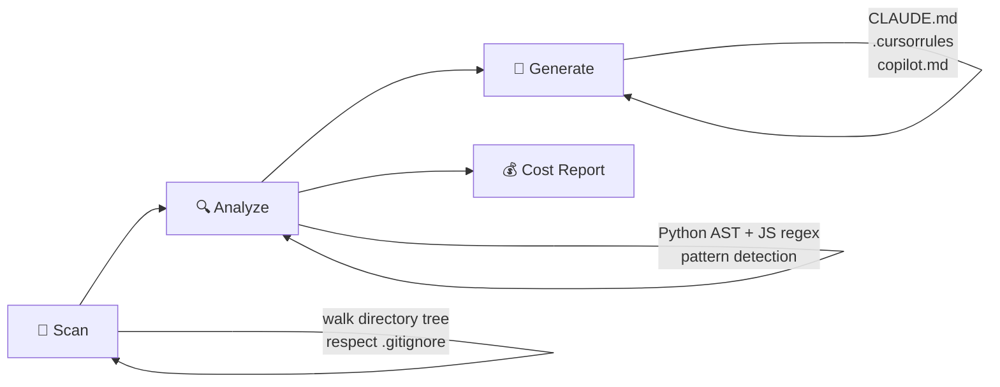

<div align="center">


### Your AI tools are reading your entire codebase every session. That's expensive.

**contextly** generates a single, optimized context file so they don't have to.

<br/>

[](https://pypi.org/project/contextly/)
[](https://pypi.org/project/contextly/)
[](https://github.com/sanyamk23/contextly/actions)
[](https://opensource.org/licenses/MIT)

[Get Started](#-get-started-in-30-seconds) · [How It Works](#-how-it-works) · [Supported Tools](#-supported-tools) · [Cost Calculator](#-cost-savings)

<br/>
</div>

---

## The Problem

Every time you start a Claude Code, Cursor, or Copilot session, the AI reads dozens of your files to understand your project.

```
$ claude
> Hey, can you fix the bug in the auth module?

⏳ AI is reading 47 files to understand your codebase...
   8,400 tokens spent just on context loading
   $0.025 burned before you even asked a question
```

For a solo developer, that's **$15–30/month** in wasted tokens. For a team of 10? **$300–800/month** — just for the AI to remember what your project does.

---

## The Solution

contextly scans your codebase **once** and generates a compact context file (~300 tokens) that tells the AI everything it needs — architecture, conventions, entry points, dependencies, patterns, and gotchas.

```bash
pip install contextly
cd your-project
contextly generate
```

```
$ contextly generate

  contextly — analyzing .

  Found 247 files (183 source, 42 tests)
  Generated CLAUDE.md

  ┌─────────────────────────────────────── Generation Stats ─┐
  │ Format: claude            Output: CLAUDE.md               │
  │ Files analyzed: 247       Context tokens: 342             │
  │ Source tokens: 24.1K      Tokens saved: 23.8K (98.6%)     │
  └───────────────────────────────────────────────────────────┘
```

**98.6% fewer context tokens. Same quality.**

---

## How It Works

contextly does real analysis — not just file listing:



| Step | What it does |
|---|---|
| **Scan** | Walk your directory tree, respect .gitignore, categorize source/config/test/doc files |
| **Analyze** | AST-level code parsing, convention detection, dependency extraction, pattern recognition |
| **Generate** | Assemble into optimized markdown, token-budget aware, no fluff |

### What Gets Detected

| Category | Examples |
|---|---|
| **Tech Stack** | Languages, frameworks, runtime versions |
| **Architecture** | Project size, patterns (MVC, Service/Repository, Middleware) |
| **Entry Points** | `main.py`, `app.py`, `index.ts`, `cli.py` |
| **Conventions** | Naming (snake_case, camelCase), indentation, quotes, type hints |
| **Dependencies** | pyproject.toml, package.json, Cargo.toml, go.mod, Gemfile |
| **Testing** | Framework (pytest, jest, vitest), test location, source-to-test ratio |
| **Gotchas** | Missing tests, large files, multi-language complexity |

---

## Supported Tools

<table>
<tr>
<td align="center" width="25%">

**Claude Code**
<br/>
<code>contextly generate</code>
<br/>
<sub>→ CLAUDE.md</sub>

</td>
<td align="center" width="25%">

**Cursor**
<br/>
<code>contextly generate -f cursor</code>
<br/>
<sub>→ .cursorrules</sub>

</td>
<td align="center" width="25%">

**GitHub Copilot**
<br/>
<code>contextly generate -f copilot</code>
<br/>
<sub>→ .github/copilot-instructions.md</sub>

</td>
<td align="center" width="25%">

**Any AI Tool**
<br/>
<code>contextly generate -f generic</code>
<br/>
<sub>→ CONTEXT.md</sub>

</td>
</tr>
</table>

---

## Cost Savings

See exactly how much you'll save:

```
$ contextly cost

  Tokens to explain codebase (without context):  24.1K
  Tokens with contextly:                          342
  Tokens saved per session:                     23.8K

  ┌──────────────────┬────────────┬───────────┬───────────┬───────────────┐
  │ Provider         │ Without    │ With      │ Saved     │ Monthly (10)  │
  ├──────────────────┼────────────┼───────────┼───────────┼───────────────┤
  │ Claude Opus 4    │   $0.3615  │  $0.0051  │  99%      │      $35.64   │
  │ Claude Sonnet 4  │   $0.0723  │  $0.0010  │  99%      │       $7.13   │
  │ GPT-4o           │   $0.0603  │  $0.0009  │  99%      │       $5.94   │
  │ Gemini 2.5 Pro   │   $0.0301  │  $0.0004  │  99%      │       $2.97   │
  └──────────────────┴────────────┴───────────┴───────────┴───────────────┘
```

### Team Scale

| Team Size | Sessions/Day | Monthly Savings (Claude Sonnet 4) |
|---|---|---|
| 1 dev | 20 | ~$14 |
| 5 devs | 20 | ~$71 |
| 10 devs | 20 | ~$142 |
| 20 devs | 20 | ~$284 |

---

## Get Started in 30 Seconds

### Install

```bash
pip install contextly
```

### Generate

```bash
cd your-project
contextly generate
```

### Use

That's it. The generated `CLAUDE.md` (or `.cursorrules`) is automatically picked up by your AI tool.

```bash
# See detailed codebase analysis
contextly analyze

# See cost savings breakdown
contextly cost

# Check if context is fresh (for CI)
contextly check
```

---

## CI Integration

Keep your context files fresh on every push:

```yaml
# .github/workflows/update-context.yml
name: Update AI Context
on:
  push:
    branches: [main]

permissions:
  contents: write

jobs:
  update:
    runs-on: ubuntu-latest
    steps:
      - uses: actions/checkout@v4
      - uses: actions/setup-python@v5
        with:
          python-version: '3.12'
      - run: pip install contextly
      - run: contextly generate
      - run: contextly generate --format cursor
      - name: Commit if changed
        run: |
          git config user.name "github-actions[bot]"
          git add CLAUDE.md .cursorrules
          git diff --cached --quiet || git commit -m "chore: update context [skip ci]"
          git push
```

---

## Example Output

<details>
<summary><b>Click to see generated CLAUDE.md</b></summary>

```markdown
# my-api

A REST API for managing user accounts and authentication.

## Tech Stack
- **Python** (15 files)
- **TypeScript** (8 files)

## Architecture
Built with pip. Medium codebase (15 source files). Uses FastAPI web application.

## Key Entry Points
- `app/main.py`
- `cli.py`

## Project Structure
├── app/
│   ├── __init__.py
│   ├── main.py
│   ├── models.py
│   └── routes/
├── tests/
├── pyproject.toml
└── README.md

## Dependencies
**pip** — 12 dependencies (3 dev)

### Core Dependencies
- `fastapi` >=0.100.0
- `uvicorn` >=0.20.0
- `sqlalchemy` >=2.0

## Code Conventions
- **Naming:** snake_case
- **Indentation:** 4 spaces
- **Quote style:** double
- **Type hints:** Yes
- **Docstrings:** Yes

## Patterns
- FastAPI web application
- Service/Repository pattern

## Testing
Framework: pytest
Test files: 12 files
Location: tests
```

</details>

---

## Commands

| Command | Description |
|---|---|
| `contextly generate` | Generate context file (default: CLAUDE.md) |
| `contextly generate -f cursor` | Generate .cursorrules for Cursor |
| `contextly generate -f copilot` | Generate Copilot instructions |
| `contextly generate -f generic` | Generate generic CONTEXT.md |
| `contextly generate -o custom.md` | Custom output path |
| `contextly analyze` | Detailed codebase analysis |
| `contextly analyze --json` | Analysis as JSON |
| `contextly cost` | Show token cost savings |
| `contextly cost --team` | Show team-wide estimates |
| `contextly check` | Verify context freshness (CI) |

---

## Supported Languages

contextly works with any project structure. Deep analysis available for:

| Language | AST Analysis | Dependency Detection |
|---|---|---|
| Python | Full (ast module) | pyproject.toml, requirements.txt, setup.py |
| JavaScript/TypeScript | Regex-based | package.json |
| Go | Regex-based | go.mod |
| Rust | Regex-based | Cargo.toml |
| Ruby | — | Gemfile |
| Java/Kotlin | — | — |
| C/C++ | — | — |

---

## Contributing

Contributions welcome! See [CONTRIBUTING.md](CONTRIBUTING.md) for guidelines.

### Development

```bash
git clone https://github.com/sanyamk23/contextly.git
cd contextly
python3 -m venv .venv
source .venv/bin/activate
pip install -e ".[dev]"
pytest
```

### Roadmap

- [ ] Incremental context updates (diff-based merging)
- [ ] VS Code extension
- [ ] Monorepo workspace support
- [ ] Language-specific deep analysis (Go, Rust, Java)
- [ ] Team context sharing registry
- [ ] Context freshness scoring
- [ ] Pre-commit hook integration

---

## License

MIT — see [LICENSE](LICENSE)

---

<div align="center">

**Stop wasting tokens. Start generating context.**

```bash
pip install contextly
```

<br/>


</div>
